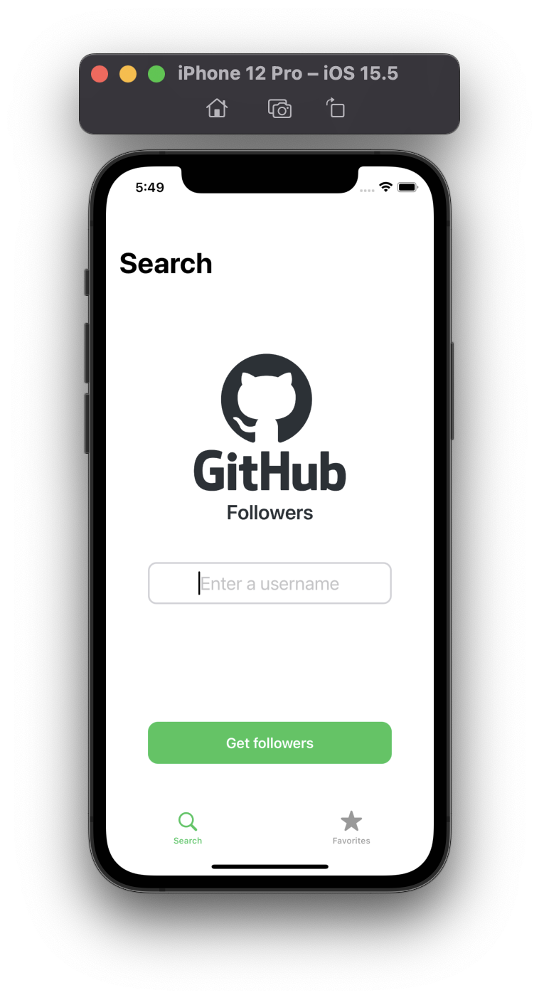
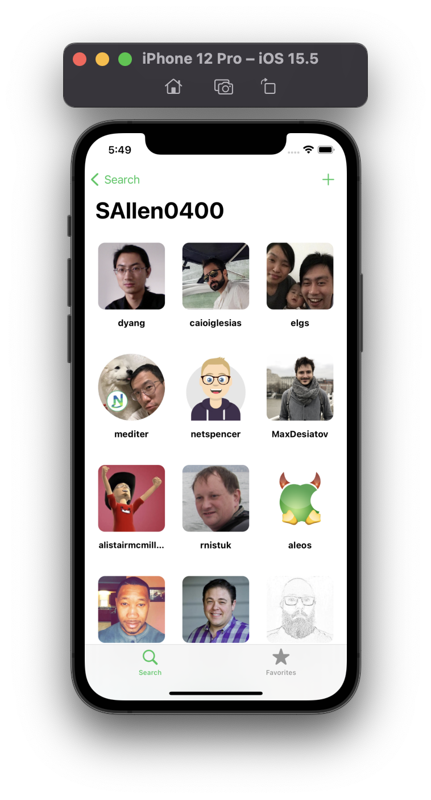
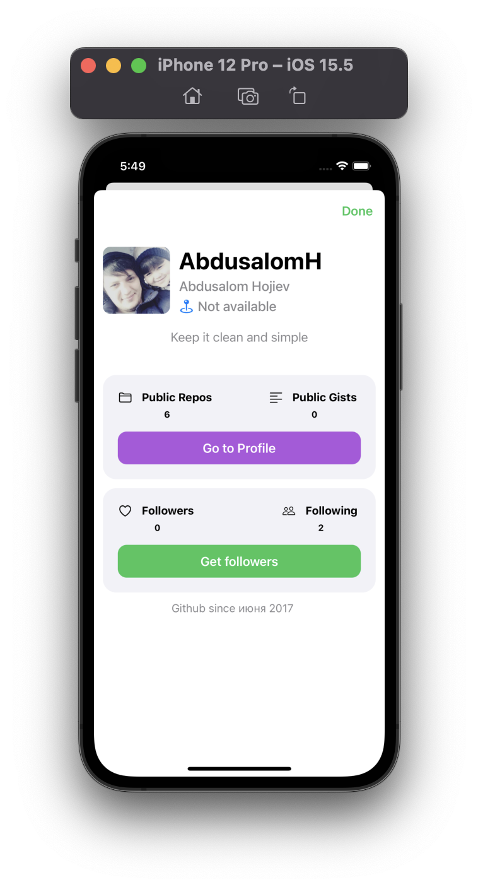
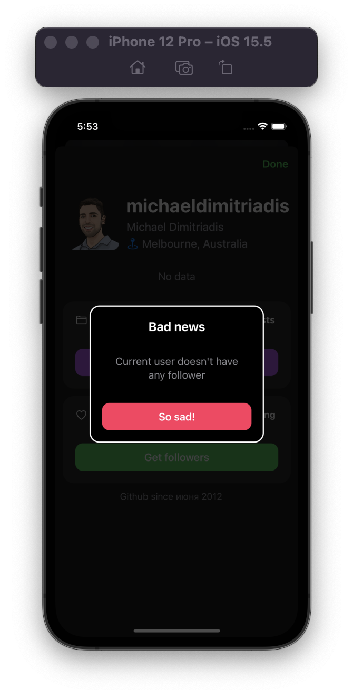

Git Followers app - it's a pet project with Git-followers, also added custom alert, new way implementing collectioview table. 

Source Sean Allen course. 

1. 100% Programatically,
2. UIKit,
3. URLSession,
4. AutoLayout,
5. CollectionView,
6. Tableview,
5. MVC,

| App navigation        |
|-----------------------|
|      |

| Main Screen           | Followers            |   User profile page   |   Dark mode           |
| ----------------------| ---------------------|-----------------------|-----------------------|
|    |    |  |     |
